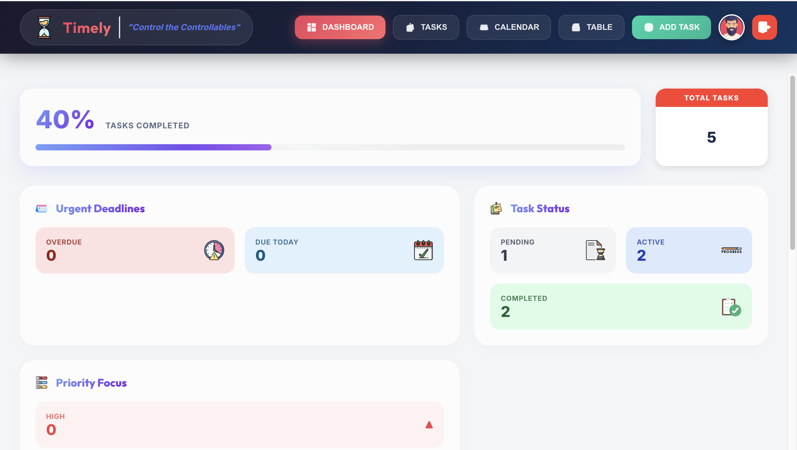
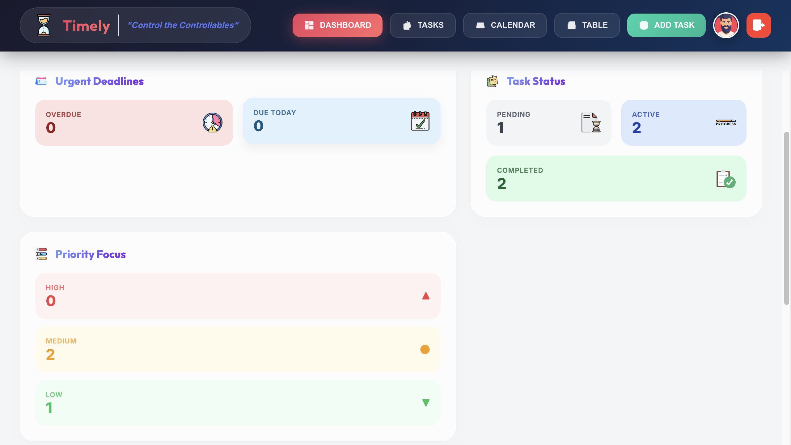
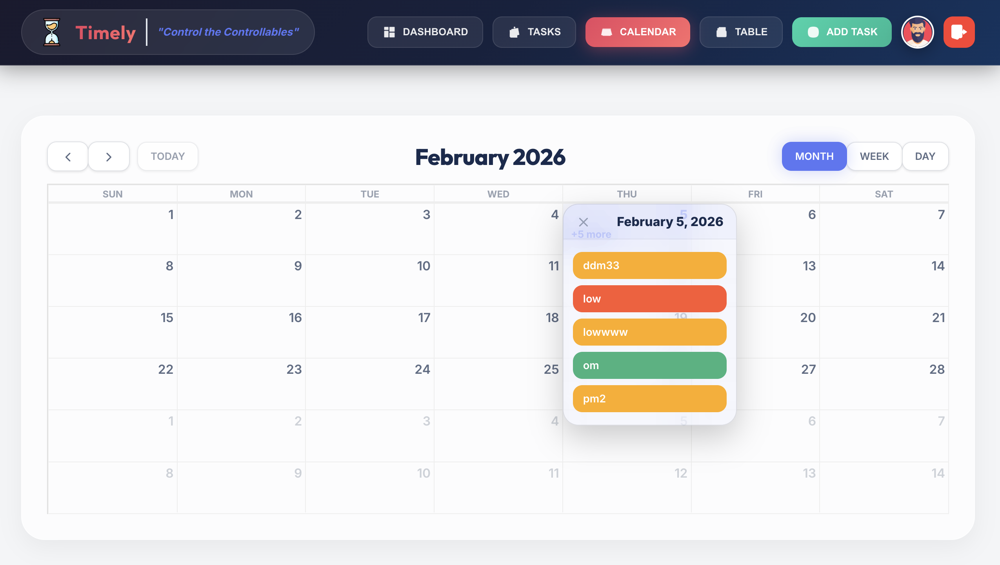
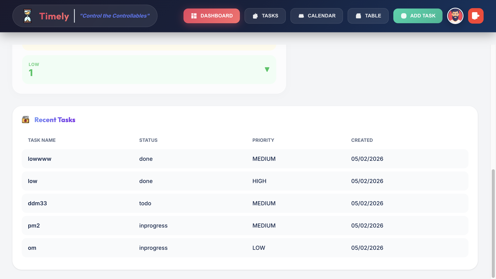
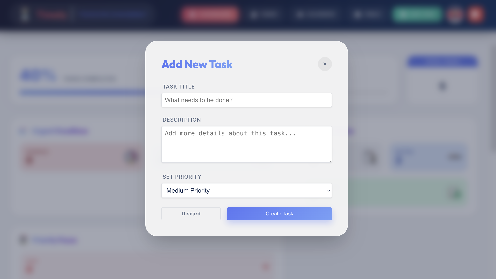
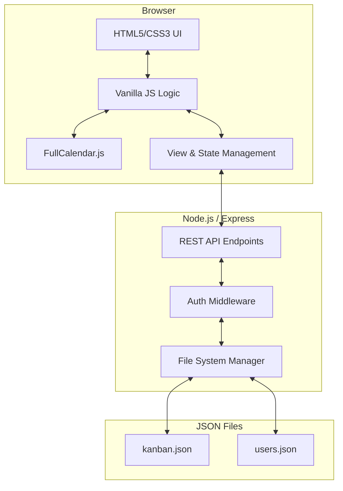

# Timely - Smart Task Manager

Timely is a modern, responsive full-stack Kanban task management application designed to help users "Control the Controllables". It features a sleek glassmorphism UI, a comprehensive dashboard, and integrated calendar functionality.



### 🖥️ Landing Page


### 🔑 Login Page


### 📊 Main Dashboard


### 📈 Interactive Stats


### 📋 Kanban Board


### 🗓️ Calendar View


### 📑 Task Table


### ➕ Task Modal


## 🚀 Features

### 📋 Task Management
- **Kanban Board**: Drag-and-drop tasks between "To Do", "In Progress", and "Done".
- **Task Operations**: Create, edit, and delete tasks with ease.
- **Priority Indicators**: Visual color-coded badges for High, Medium, and Low priority.
- **Table View**: A detailed list view for tracking all tasks in a structured format.

### 📊 Modern Dashboard
- **Bento Grid Layout**: A sleek, modern dashboard inspired by top-tier SaaS designs.
- **Real-time Stats**: Track total tasks, pending items, completed goals, and overdue reminders.
- **Integrated Calendar**: FullCalendar integration to visualize task distribution and deadlines.
- **Glassmorphism UI**: High-end dark theme design with blurred elements and vibrant gradients.

### 🔐 User Experience
- **Authentication**: Secure login and multi-user support (locally persisted).
- **Global Search**: Quickly find tasks across all status columns.
- **Mobile Responsive**: Fully adaptive design that works on desktops, tablets, and smartphones.
- **Live Clock**: Built-in header clock for time management.

## 🛠️ Technical Stack

- **Frontend**: 
  - Vanilla JavaScript (ES6+)
  - HTML5 & Semantic Elements
  - CSS3 (Custom design system with CSS Variables)
  - FullCalendar.js (Calendar rendering)
- **Backend**:
  - Node.js (Runtime)
  - Express.js (Web Server & API)
- **Data Persistence**:
  - JSON File Storage (`kanban.json`, `users.json`)
  - No external database required (Local persistence)

## 📂 Project Structure

```
Kanban_Project/
├── server.js           # Node.js/Express backend & API
├── script.js           # Vanilla JS frontend logic
├── index.html          # Main application structure
├── style.css           # Custom design system & styles
├── kanban.json         # Persistent task storage
├── users.json          # Persistent user storage
├── images/             # UI assets and icons
└── node_modules/       # Backend dependencies
```

## 🏗️ Project Architecture

Timely follows a standard client-server architecture with local file-based data persistence.



### Core Architecture Components:
1.  **Frontend (Vanilla JS)**: 
    - Uses asynchronous `fetch` calls to communicate with the backend.
    - Implements a custom **View Switching Engine** to toggle between Dashboard, Board, Table, and Calendar views without page reloads.
    - Manages local state for drag-and-drop operations using the **HTML5 Drag and Drop API**.
2.  **Backend (Node.js & Express)**:
    - Serves static assets (HTML, CSS, JS, Images).
    - Provides a **RESTful API** for task CRUD operations and user authentication.
    - Implements middleware for logging and request parsing.
3.  **Data Persistence (JSON)**:
    - Uses the Node.js `fs` (file system) module to read and write data to local `.json` files.
    - Implements basic data validation before writing to ensure persistence integrity.
    - Supports multi-user data isolation by filtering tasks based on the authenticated `username`.

## ⚙️ Getting Started

### Prerequisites
- Node.js (v18 or higher)
- npm

### Installation & Run

1. **Clone the project**
   ```bash
   git clone <repository-url>
   cd Kanban_Project
   ```

2. **Install dependencies**
   ```bash
   npm install
   ```

3. **Start the server**
   ```bash
   npm start
   # or
   node server.js
   ```

4. **Access the app**
   Open your browser and navigate to `http://localhost:3000`

## 🛡️ License
This project is licensed under the MIT License.

## ✨ Acknowledgments
- Inspired by modern Kanban and Task Management systems.
- Built as part of an advanced full-stack development internship.
- Special thanks to the "Timely" design philosophy: *Control the Controllables*.
